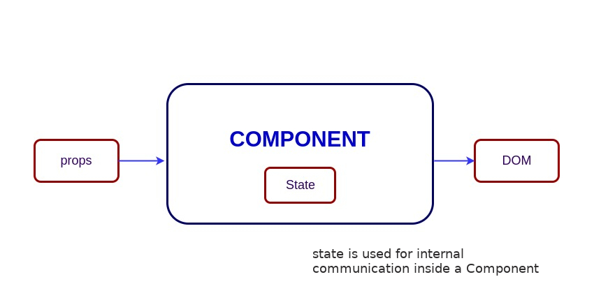

# React Topics

## Table of Contents
- [What is React?
](#what-is-react)
- [What is React's History?
](#what-is-reacts-history)
- [What are the major features of React?
](#what-are-the-major-features-of-react)
- [What is JSX?
](#what-is-jsx)
- [Do you have to use React with JSX?
](#do-you-have-to-use-react-with-jsx)
- [What is the difference between an Element and a Component?
](#what-is-the-difference-between-an-element-and-a-component)
- [How to create components in React?
](#how-to-create-components-in-react)
- [When to use a Class Component over a Function Component?
](#when-to-use-a-class-component-over-a-function-component)
- [What are Pure Components?
](#what-are-pure-components)
- [What is state in React?
](#what-is-state-in-react)
- [What are props in React?
](#what-are-props-in-react)
- [What is the difference between state and props?
](#what-is-the-difference-between-state-and-props)
- [Why should we not update the state directly?
](#why-should-we-not-update-the-state-directly)
- [What is the difference between a controlled and uncontrolled component/input/element/form?
](#what-is-the-difference-between-a-controlled-and-uncontrolled-componentinputelementform)
- [How can you share state between multiple components?
](#how-can-you-share-state-between-multiple-components)
- [What is the purpose of callback function as an argument of setState()?
](#what-is-the-purpose-of-callback-function-as-an-argument-of-setstate)
- [What is the difference between HTML and React event handling?
](#what-is-the-difference-between-html-and-react-event-handling)
- [How to bind methods or event handlers in JSX callbacks?
](#how-to-bind-methods-or-event-handlers-in-jsx-callbacks)
- [What is the Shadow DOM?
](#what-is-the-shadow-dom)
- [What is Virtual DOM?
](#what-is-virtual-dom)
- [How does the Virtual DOM work?
](#how-does-the-virtual-dom-work)
- [What are hooks in React?
](#what-are-hooks-in-react)
- [How is the useState hook typically used, what are some pitfalls?
](#how-is-the-usestate-hook-typically-used-what-are-some-pitfalls)
- [How is the useEffect hook typically used, what are some pitfalls?
](#how-is-the-useeffect-hook-typically-used-what-are-some-pitfalls)
- [What happens when a component receives new props?
](#what-happens-when-a-component-receives-new-props)
- [What are some common pitfalls when fetching data in React?
](#what-are-some-common-pitfalls-when-fetching-data-in-react)
- [What is the difference between var and let?
](#what-is-the-difference-between-var-and-let)
- [What is a callback, when would you use one?
](#what-is-a-callback-when-would-you-use-one)
- [What is hoisting?
](#what-is-hoisting)
- [What is a closure?
](#what-is-a-closure)
- [What is the event loop?
](#what-is-the-event-loop)
- [When is it a good idea to use a class in react?
](#when-is-it-a-good-idea-to-use-a-class-in-react)
- [What are some of the rules of React Hooks and why do those rules exist?
](#what-are-some-of-the-rules-of-react-hooks-and-why-do-those-rules-exist)
- [E
](#e)

### What is React?

React, React.js or ReactJS is an open-source front-end JavaScript library that is used for building composable user interfaces, especially for single-page applications. It is used for handling view layer for web and mobile apps based on components in a declarative approach.

[↑ Back to top](#react-topics)

### What is React's History?

The foundation for ReactJS started in 2010 with the creation of XHP, a PHP extension designed to improve PHP's syntax for creating reusable HTML elements. This project laid the groundwork for React's development.


React was created by Jordan Walke, a software engineer at Facebook. The initial prototype, known as 'FaxJS', aimed to address inefficiencies in dynamic UI development.


React was first used in Facebook's News Feed in 2011 and on Instagram in 2012. The success of React in these applications showcased its potential to streamline front-end development.


In 2013, React was officially open-sourced at JSConf US, making it available to the wider developer community. This marked the beginning of its rapid adoption and ecosystem growth.


React Native was released in 2015, extending React's component-based model to mobile app development and further solidifying React's position in the developer community.


In 2016, the React team announced the development of React Fiber, a complete rewrite of React's core algorithm, to enhance its capabilities and performance.


React 16 was released in 2017, incorporating the new Fiber rendering engine. This update brought significant performance improvements and introduced features like error boundaries and fragments.


Hooks were introduced in React 16.8 in 2018, offering a powerful new way to use state and other React features in functional components, marking a significant evolution in React's development.


Since then, React has continued to evolve, with the React team focusing on features like concurrent mode, server components, and improving the overall developer experience.

[↑ Back to top](#react-topics)

### What are the major features of React?

The major features of React are:
- Uses JSX syntax, a syntax extension of JS that allows developers to write HTML in their JS code.
- Uses the Virtual DOM instead of the real DOM, since DOM manipulations are expensive.
- Supports server-side rendering, which is useful for Search Engine Optimization (SEO).
- Follows unidirectional or 'one-way' data flow or data binding.
- Has reusable/composable UI components to develop the view.

[↑ Back to top](#react-topics)

### What is JSX?

JSX stands for JavaScript XML and it is an XML-like syntax extension to ECMAScript. Basically it just provides the syntactic sugar for the React.createElement(type, props, ...children) function, giving us the expressiveness of JavaScript along with HTML-like template syntax. JSX is stricter than HTML.
In the example below, the text inside the h1 tag is returned as a JavaScript function to the render function.
```javascript
export default function App() {
  return <h1 className="greeting">{"Hello, this is a JSX Code!"}</h1>;
}

```
If you don't use JSX syntax then the respective JavaScript code should be written as below,
```javascript
import { createElement } from "react";
export default function App() {
  return createElement(
    "h1",
    { className: "greeting" },
    "Hello, this is a JSX Code!",
  );
}

```

[↑ Back to top](#react-topics)

### Do you have to use React with JSX?

No, you do not have to use React with JSX. JSX is a popular syntax extension for JavaScript that allows you to write HTML-like code in your JavaScript files, making it easier to create React elements. However, it is entirely optional. React can be used without JSX by using plain JavaScript to create your UI components. JSX is syntactic sugar over React's createElement function, which is the underlying method for defining UI elements in React. Each JSX element is transpiled into a React.createElement call by Babel or another transpiler.


While JSX makes your code more readable and concise, especially for complex UI structures, using `React.createElement` directly can give you a deeper understanding of React's working principles. It can also be useful in environments where you cannot or prefer not to use a JSX transpiler. However, for larger projects or when working with teams, the clarity and simplicity offered by JSX often outweigh the benefits of avoiding it.

[↑ Back to top](#react-topics)

### What is the difference between an Element and a Component?

 A React element is an object representation of a DOM node. It's what you see in the virtual DOM, describing what you want to see on the screen. React elements are immutable, plain objects that describe the structure of UIs. Elements are created using React.createElement() or JSX tags. For example: `<div />` translates to React.createElement('div'). Think of elements as the "blueprints" or descriptions of what you want to see on the screen. They are not actual DOM nodes; they are just objects that tell React what the DOM should look like.
 

A component in React is a reusable piece of the UI. It can be a class or a function that optionally accepts inputs (props) and returns a React element. Components let you split the UI into independent, reusable pieces that handle their own state. There are two main types of components in React: Class Components and Functional Components. Class components are ES6 classes that extend from React.Component and can have state and lifecycle methods. Functional components are simpler functions that return JSX and can use hooks for state and side effects. Components can accept and use props to produce different elements based on the input data. They can maintain internal state, and when the state or props change, React decides whether to re-render the component. Components are the building blocks of React applications. They encapsulate behavior and rendering logic, making it easy to develop, maintain, and scale UIs.


Example JavaScript representation (without JSX) of a React Element:
```javascript
const element = React.createElement("div", { id: "login-btn" }, "Login");

```
The above `React.createElement()` function returns an object as below:
{
  "type": "div",
  "props": {
    "children": "Login",
    "id": "login-btn"
  }
}
Finally, this element renders to the DOM using ReactDOM.render(). A component can be declared in several different ways. It can be a class with a render() method or it can be defined as a function. In either case, it takes props as input, and returns a JSX tree as the output:
```javascript
const Button = ({ handleLogin }) => (
  <div id={"login-btn"} onClick={handleLogin}>
    Login
  </div>
);

```
Then JSX gets transpiled to a React.createElement() function tree:
```javascript
const Button = ({ handleLogin }) =>
  React.createElement(
    "div",
    { id: "login-btn", onClick: handleLogin },
    "Login",
  );

```
Key Differences
- An element is a static description of what you want to render, whereas a component can contain logic and state. A component returns an element (or a tree of elements) that React will then render.
- Elements are the smallest building blocks of React apps, and components are composed of those elements.
- Elements are immutable objects that represent the UI at a certain point in time. Components can be dynamic, managing state, and responding to user input.

[↑ Back to top](#react-topics)

### How to create components in React?

Components are the building blocks of creating User Interfaces(UI) in React. There are two possible ways to create a component.
- Function Components: This is the simplest way to create a component. Those are pure JavaScript functions that accept props object as the first parameter and return React elements to render the output
```javascript
function Greeting({ message }) {
  return <h1>{`Hello, ${message}`}</h1>;
}

```
- Class Components: You can also use ES6 class to define a component. The above function component can be written as a class component:
```javascript
class Greeting extends React.Component {
  render() {
    return <h1>{`Hello, ${this.props.message}`}</h1>;
  }
}

```

[↑ Back to top](#react-topics)

### When to use a Class Component over a Function Component?

After the addition of Hooks(i.e. React 16.8 onwards) it is always recommended to use Function components over Class components in React. Because you could use state, lifecycle methods and other features that were only available in class component present in function component too.
But even there are two reasons to use Class components over Function components: 
1. If you need a React functionality whose Function component equivalent is not present yet, like Error Boundaries. 
2. In older versions, if the component needs state or lifecycle methods then you need to use class component.
Note: You can also use reusable react error boundary third-party component without writing any class. i.e, No need to use class components for Error boundaries.
```javascript
"use client";
import { ErrorBoundary } from "react-error-boundary";
<ErrorBoundary fallback={<div>Something went wrong</div>}>
  <ExampleApplication />
</ErrorBoundary>;

```

[↑ Back to top](#react-topics)

### What are Pure Components?

Pure components are the components which render the same output for the same state and props. In function components, you can achieve these pure components through memoized React.memo() API wrapping around the component. This API prevents unnecessary re-renders by comparing the previous props and new props using shallow comparison. So it will be helpful for performance optimizations.
But at the same time, it won't compare the previous state with the current state because function component itself prevents the unnecessary rendering by default when you set the same state again.
The syntactic representation of memoized components looks like below,
```javascript
const MemoizedComponent = memo(SomeComponent, arePropsEqual);

```
Below is the example of how the child component EmployeeProfile prevents re-renders for the same props passed by parent component (EmployeeRegForm).
```javascript
import { memo, useState } from "react";
const EmployeeProfile = memo(function EmployeeProfile({ name, email }) {
  return (
    <>
      {" "}
      <p>Name:{name}</p> <p>Email: {email}</p>
    </>
  );
});
export default function EmployeeRegForm() {
  const [name, setName] = useState("");
  const [email, setEmail] = useState("");
  return (
    <>
      <label>
        Name: <input value={name} onChange={(e) => setName(e.target.value)} />
      </label>
      <label>
        Email:{" "}
        <input value={email} onChange={(e) => setEmail(e.target.value)} />
      </label>
      <hr />
      <EmployeeProfile name={name} />
    </>
  );
}

```
In the above code, the email prop has not been passed to child component. So there won't be any re-renders for email prop change.

In class components, the components extending React.PureComponent instead of React.Component become the pure components. When props or state changes, PureComponent will do a shallow comparison on both props and state by invoking shouldComponentUpdate() lifecycle method.

Note: `React.memo()` is a higher-order component.

[↑ Back to top](#react-topics)

### What is state in React?

State of a component is an object that holds some information that may change over the lifetime of the component. The important point is whenever the state object changes, the component re-renders. It is always recommended to make our state as simple as possible and minimize the number of stateful components.

Let's take an example of User component with message state. Here, useState hook has been used to add state to the User component and it returns an array with current state and function to update it.
```javascript
import React, { useState } from "react";
function User() {
  const [message, setMessage] = useState("Welcome to React world");
  return (
    <div>
      <h1>{message}</h1>
    </div>
  );
}

```
State is similar to props, but it is private and fully controlled by the component, i.e., it is not accessible to any other component till the owner component decides to pass it.

[↑ Back to top](#react-topics)

### What are props in React?

In React, props (short for "properties") are a way of passing data from parent to child components, thereby making those child components reusable and dynamic. Props are read-only and are meant to be passed to the component similar to function parameters. They are the primary mechanism for component communication in React, allowing data flow from parent components down to their children.

Props are immutable within the child component, which means that a component cannot change its own props.

Props can be used to pass data (like strings, numbers, objects, arrays, functions, etc.) and callback functions to child components. This allows child components to behave dynamically based on the data they receive.

Props in a functional component:
```javascript
function Greeting(props) {
  return <h1>Hello, {props.name}!</h1>;
}
function App() {
  return <Greeting name="React" />;
}

```
Props in a class component:
```javascript
class Greeting extends React.Component {
  render() {
    return <h1>Hello, {this.props.name}!</h1>;
  }
}
class App extends React.Component {
  render() {
    return <Greeting name="React" />;
  }
}

```

[↑ Back to top](#react-topics)

### What is the difference between state and props?

In React, both `state` and `props` are plain JavaScript objects and used to manage the data of a component, but they are used in different ways and have different characteristics. `state` is managed by the component itself and can be updated using the `setState()` function. Unlike props, state can be modified by the component and is used to manage the internal state of the component. Changes in the state trigger a re-render of the component and its children. `props` (short for "properties") are passed to a component by its parent component and are `read-only`, meaning that they cannot be modified by the component itself. `props` can be used to configure the behavior of a component and to pass data between components.

[↑ Back to top](#react-topics)

### Why should we not update the state directly?

If you try to update the state directly then it won't re-render the component. Instead use `setState()` method. It schedules an update to a component's state object. When state changes, the component responds by re-rendering. Note: You can directly assign to the state object either in constructor or using latest javascript's class field declaration syntax.

[↑ Back to top](#react-topics)

### What is the difference between a controlled and uncontrolled component/input/element/form?

In React, the distinction between controlled and uncontrolled components pertains to how form data is managed and interacts with the component's state.

A controlled component has its value controlled by React. You manage the form data with a state within the component. Each state mutation will have an associated handler function, making React the "single source of truth" regarding the form data. This approach allows you to easily validate or modify user input. Here's a simple example of a controlled component:
```javascript
class ControlledComponent extends React.Component {
  constructor(props) {
    super(props);
    this.state = { value: "" };
    this.handleChange = this.handleChange.bind(this);
    this.handleSubmit = this.handleSubmit.bind(this);
  }
  handleChange(event) {
    this.setState({ value: event.target.value });
  }
  handleSubmit(event) {
    alert("A name was submitted: " + this.state.value);
    event.preventDefault();
  }
  render() {
    return (
      <form onSubmit={this.handleSubmit}>
        <label>
          Name:
          <input
            type="text"
            value={this.state.value}
            onChange={this.handleChange}
          />
        </label>
        <input type="submit" value="Submit" />
      </form>
    );
  }
}

```

An uncontrolled component works like form elements traditionally do in HTML. Instead of writing an event handler for all ways your data might change and funneling all input through a React state, you use a ref to retrieve values from the DOM. This means the form data is handled by the DOM itself. Here's an example of an uncontrolled component:
```javascript
class UncontrolledComponent extends React.Component {
  constructor(props) {
    super(props);
    this.input = React.createRef();
  }
  handleSubmit = (event) => {
    alert("A name was submitted: " + this.input.current.value);
    event.preventDefault();
  };
  render() {
    return (
      <form onSubmit={this.handleSubmit}>
        {" "}
        <label>
          {" "}
          Name: <input type="text" ref={this.input} />{" "}
        </label>{" "}
        <button type="submit">Submit</button>{" "}
      </form>
    );
  }
}

```

Controlled components:
- Offer more control and flexibility. You can validate or change user input on the fly.
- React state is the source of truth, making the data flow easier to understand.
- Requires more boilerplate code for handling changes and setting values.

Uncontrolled Components:
- Less code is required as you don't need to write handlers for every way data can change.
- More similar to traditional HTML form handling.
- The DOM itself is the source of truth, which may make managing data flow less straightforward in complex applications.

[↑ Back to top](#react-topics)

### How can you share state between multiple components?

Sharing state between multiple components in React can be achieved through several strategies, depending on the complexity of the application and the relationship between components. Here are some common methods:
- Lifting State Up: Move the state to the nearest common ancestor of the components that need it. Pass the state down to the components that need it through props and changes to the state are communicated back up through callbacks.
- Component Composition: Use React context to create a global state that can be accessed by any component in the component tree. Context provides a way to pass data through the component tree without having to pass props down manually at every level.
- Global State Management Libraries: Use libraries like Redux or MobX that offer more sophisticated solutions for managing global state in a React app. These libraries provide mechanisms to store state outside of your component tree and mechanisms to easily access and update that state from anywhere in your app.
- Custom Hooks: Create custom hooks that encapsulate shared logic and state. Components that need to share this state can use the custom hook to access and manipulate the state.
- Prop Drilling (Passing Props): Although not efficient for deeply nested components, you can pass state and callbacks as props from a parent component down to its descendants. This method is straightforward but can become cumbersome as the application grows.
- Use of Higher-Order Components (HOCs): HOCs can wrap multiple components, providing them with shared state or logic. This pattern is useful for reusing component logic.
- Render Props: Share state between components using a function prop that the component uses to know what to render. This is a more flexible way to share state but can lead to more complex patterns.

[↑ Back to top](#react-topics)

### What is the purpose of callback function as an argument of setState()?

The callback function is invoked when setState finished and the component gets rendered. Since `setState()` is asynchronous the callback function is used for any post action.

Note: It is recommended to use lifecycle methods rather than this callback function.
```javascript
setState({ name: "John" }, () =>
  console.log("The name has updated and component re-rendered"),
);

```

[↑ Back to top](#react-topics)

### What is the difference between HTML and React event handling?

In HTML, the event name usually represents in lowercase as a convention:
```javascript
<button onclick="activateLasers()"></button>;

```
In React events such as onClick follow camelCase convention:
```javascript
<button onClick={activateLasers} />;

```
In HTML, you can return false to prevent default behavior:
```javascript
<a href="#" onclick='console.log("The link was clicked."); return false;' />;

```
Whereas in React you must call preventDefault() explicitly:
```javascript
function handleClick(event) {
  event.preventDefault();
  console.log("The link was clicked.");
}

```
In HTML, you need to invoke the function by appending () Whereas in react you should not append () with the function name. (refer to the "activateLasers" function in the first point for example)

[↑ Back to top](#react-topics)

### How to bind methods or event handlers in JSX callbacks?

There are 3 possible ways to achieve this in class components:
- 1. Binding in Constructor: In JavaScript classes, the methods are not bound by default. The same rule applies for React event handlers defined as class methods. Normally we bind them in constructor.
```javascript
class User extends Component {
  constructor(props) {
    super(props);
    this.handleClick = this.handleClick.bind(this);
  }
  handleClick() {
    console.log("SingOut triggered");
  }
  render() {
    return <button onClick={this.handleClick}>SingOut</button>;
  }
}

```
- 2. Public class fields syntax: Can be used to correctly bind callbacks. The Create React App enables this syntax by default.
```javascript
handleClick = () => {
  console.log("SignOut triggered", this);
};
<button onClick={this.handleClick}>SignOut</button>;

```
- 3. Arrow functions in callbacks: It is possible to use arrow functions directly in the callbacks.
```javascript
class Example {
  handleClick() {
    console.log("SignOut triggered");
  }
  render() {
    return <button onClick={() => this.handleClick()}>SignOut</button>;
  }
}

```
Note: If the callback is passed as a prop to child components, those components might do an extra re-rendering. In those cases, it is preferred to go with .bind() or the public class fields syntax approach considering performance.

[↑ Back to top](#react-topics)

### What is the Shadow DOM?

The Shadow DOM is a web standard designed to encapsulate the styling and markup of web components. It allows for the creation of "shadow trees" that are attached to elements in the regular DOM, providing a way to scope CSS styles to a particular part of the page without them bleeding out to affect other elements outside the shadow tree. This encapsulation helps in building more modular and reusable web components. Key aspects of the Shadow DOM include:
- Encapsulation: Styles defined inside a shadow DOM are scoped to the elements within it. Similarly, JavaScript scoped within a shadow DOM does not affect the main document or other shadow DOMs.
- DOM Isolation: The shadow DOM provides a separate, isolated DOM for a component. This means that the IDs, classes, and attributes within a shadow DOM do not conflict with those in the main document or other shadow DOMs.
- Style Scoping: CSS styles defined within a shadow DOM only apply to the content inside the shadow DOM. This prevents style leakage, where styles from the main document inadvertently affect components and vice versa.
- Composition: The Shadow DOM allows developers to compose complex applications from smaller, encapsulated components, each managing its own styles and markup.
- Slotting: The Shadow DOM specification includes a mechanism called slots, which allows for content projection. This means that you can define placeholders inside your shadow DOM that can be filled with content passed from the light DOM (the main document).

The Shadow DOM is a part of the Web Components specification, which also includes Custom Elements and HTML Templates. Together, these technologies provide a powerful way to create reusable, encapsulated, and interoperable web components. Modern browsers provide native support for the Shadow DOM, making it an essential tool for front-end developers aiming to create modular web applications.

[↑ Back to top](#react-topics)

### What is Virtual DOM?

The Virtual DOM (VDOM) is an in-memory representation of Real DOM. The representation of a UI is kept in memory and synced with the real DOM. It's a step that happens between the render function being called and the displaying of elements on the screen. This entire process is called reconciliation.

[↑ Back to top](#react-topics)

### How does the Virtual DOM work?

The Virtual DOM is a lightweight copy of the real DOM (Document Object Model) in memory. It represents the UI's structure, properties, and state in a simplified way. Because direct interactions with the real DOM are slow and performance-intensive, especially with frequent updates, the Virtual DOM serves as a faster intermediary. It works in three basic steps:
1. Changes applied to the VDOM: Whenever a change occurs (e.g., due to user interactions or data updates), the change is first applied to the Virtual DOM instead of the real DOM. This approach allows React (or similar libraries) to batch multiple changes into a single update cycle, significantly reducing direct manipulation of the real DOM, which is more costly in terms of performance.

2. VDOM state Diffing: React compares the current state of the Virtual DOM with its previous state (before the updates were applied) to determine exactly what changed. This comparison process is known as "diffing." React uses a diffing algorithm to efficiently identify differences between the old and new Virtual DOM structures.

3. Reconciliation: Based on the differences identified by the diffing algorithm, React calculates the most efficient way to update the real DOM to match the new state of the Virtual DOM. This process is called reconciliation. It ensures that the minimum number of DOM operations are performed, leading to better performance and a smoother user experience. Only the parts of the real DOM that changed are updated. If a component's state or props do not change, React avoids re-rendering that component or manipulating its corresponding DOM nodes. This selective update mechanism further optimizes performance by avoiding unnecessary work.


React's component-based architecture complements the Virtual DOM's efficiency. Components encapsulate their own state and logic, which allows React to track changes at the component level. This granularity helps in optimizing updates and renders. By using the Virtual DOM, frameworks like React can offer a declarative API for defining UI components. Developers describe what the UI should look like for any given state, and the library takes care of efficiently updating the DOM to match that description. This abstraction allows for the creation of dynamic, interactive UIs that are fast and responsive, even with complex applications that have frequent updates.

[↑ Back to top](#react-topics)

### What are hooks in React?

Hooks are a feature introduced in React 16.8 that allow you to use state and other React features without writing a class. They enable you to "hook into" React state and lifecycle features from function components. Hooks don't work inside classes — they let you use React without classes. React provides a few built-in Hooks like useState, useEffect, useContext, useReducer, useCallback, useMemo, useRef, useImperativeHandle, useLayoutEffect, and useDebugValue.

useState: This Hook lets you add React state to function components.
```javascript
import React, { useState } from "react";
function Example() {
  const [count, setCount] = useState(0);
  return (
    <div>
      {" "}
      <p>You clicked {count} times</p>{" "}
      <button onClick={() => setCount(count + 1)}> Click me </button>{" "}
    </div>
  );
}

```

useEffect: This Hook lets you perform side effects in function components. It serves the same purpose as componentDidMount, componentDidUpdate, and componentWillUnmount in React classes, but unified into a single API.
```javascript
import React, { useState, useEffect } from "react";
function Example() {
  const [count, setCount] = useState(0);
  useEffect(() => {
    document.title = `You clicked ${count} times`;
  });
  return (
    <div>
      {" "}
      <p>You clicked {count} times</p>{" "}
      <button onClick={() => setCount(count + 1)}>Click me</button>
    </div>
  );
}

```
useContext: This Hook lets you subscribe to React context without introducing nesting. It allows you to easily access the context value.
```javascript
import React, { useContext } from "react";
const ThemeContext = React.createContext("light");
function Example() {
  const theme = useContext(ThemeContext);
  return <div theme={theme}>...</div>;
}

```
Hooks are a powerful and expressive feature that make it easier to design clean, readable, and straightforward components. They allow for better reuse of stateful logic and can make your component logic more modular and easier to understand.

[↑ Back to top](#react-topics)

### How is the useState hook typically used, what are some pitfalls?

The useState hook is a fundamental part of React's Hooks API that allows you to add state to functional components. Before hooks, state could only be used in class components, but useState opens up the ability to manage state in a more functional approach.
Usage: The useState hook is used to declare a state variable in a functional component. When you call useState, you pass the initial state to this function and it returns an array containing the current state value (the first element) and a function that lets you update it (the second element).
```javascript
import React, { useState } from "react";
function Counter() {
  const [count, setCount] = useState(0);
  return (
    <div>
      <p>You clicked {count} times</p>
      <button onClick={() => setCount(count + 1)}>Click me</button>
    </div>
  );
}

```
Pitfalls and Best Practices: 
1. Not Using Functional Updates for the Previous State: When the new state depends on the old state, you should use a function inside setCount which React will pass the current state to. This ensures state consistency because of React's asynchronous state updates.
```javascript
setCount((prevCount) => prevCount + 1);

```
2. Overusing State: Splitting state into multiple state variables based on which values tend to change together can lead to simpler code and fewer re-renders compared to having a single state object. Instead of this:
```javascript
const [state, setState] = useState({ count: 0, flag: true });

```
Split state like this:
```javascript
const [count, setCount] = useState(0);
const [flag, setFlag] = useState(true);

```
3. Expecting State Updates to be Synchronous: React state updates, triggered by useState, do not happen immediately. They are asynchronous for performance reasons. Trying to read state immediately after setting it might not give the updated values. This might not log 1 because state updates are asynchronous:
```javascript
setCount(1);
console.log(count);

```
4. Initializing State from Props: Be cautious when initializing state from props. It's fine for initial state, but if you need to keep it in sync with props, consider using the useEffect hook instead.
```javascript
const [count, setCount] = useState(props.count);

```
If props.count changes and you want to update state accordingly, you'll need to use useEffect to observe changes.
5. Ignoring the Dependency Array in Effects: When using useState in conjunction with useEffect, remember to correctly manage the dependency array of useEffect to avoid infinite loops or stale closures. Understanding and avoiding these pitfalls will help you use useState more effectively, leading to cleaner and more maintainable components.

[↑ Back to top](#react-topics)

### How is the useEffect hook typically used, what are some pitfalls?

The useEffect hook lets you perform side effects in functional components. It serves the same purpose as componentDidMount, componentDidUpdate, and componentWillUnmount in React class lifecycle methods, but unified into a single API.

Typical Usage: useEffect is used for data fetching, setting up a subscription, or manually changing the DOM in React components. It runs after the first render and after every update by default. 
Here's a basic example to fetch data:
```javascript
import React, { useState, useEffect } from "react";

function Example() {
  const [data, setData] = useState([]);

  useEffect(() => {
    fetch("https://api.example.com/data")
      .then((response) => response.json())
      .then((data) => setData(data));
  }, []); // The empty array means this effect runs once after the initial render

  return (
    <div>
      {data.map((item) => (
        <div key={item.id}>{item.title}</div>
      ))}
    </div>
  );
}

```
Pitfalls and Best Practices 

1.Forgetting to Specify the Dependency Array: Not providing a dependency array or forgetting to include a variable used inside useEffect can lead to unexpected behavior. It might cause the effect to run more often than needed.
```javascript
useEffect(() => {
  console.log("Component updated");
});

```
2. Including Functions in the Dependency Array Without Wrapping in useCallback: If you pass functions to the dependency array, ensure they are stable between renders by wrapping them with useCallback.
```javascript
const stableFunction = useCallback(() => {
  console.log("This function is stable between renders");
}, []);

```
3. Excessive Fetching on Updates: Ensure the effect only runs when necessary by correctly specifying dependencies to avoid unnecessary network requests.
```javascript
useEffect(() => {
  fetchData(id);
}, [id]); // Only re-run the effect if `id` changes

```
4. Cleaning up Effects: Always return a cleanup function from effects that set up a subscription or listeners to prevent memory leaks.
```javascript
useEffect(() => {
  const subscription = dataSource.subscribe();
  return () => {
    subscription.unsubscribe();
  };
}, []);

```
5. Infinite Loops: Be cautious with dependencies to avoid infinite loops. Ensure effects do not endlessly trigger themselves.


6. Ignoring Effect Timing: Effects run after paint, so consider potential UI flickers. Use CSS or conditional rendering to mitigate visible delays.

[↑ Back to top](#react-topics)

### What happens when a component receives new props?

When a React component receives new props, a few things happen in sequence to ensure the component reflects the updated props:

getDerivedStateFromProps is called (if it is defined): This static method is called right before rendering, both on the initial mount and on subsequent updates. It's used to update the state based on changes in props over time. During this process, React ensures that the component accurately represents the new props, maintaining the UI in sync with the data:
- 1. `getDerivedStateFromProps` is called (if it is defined): This static method is called right before rendering, both on the initial mount and on subsequent updates. It's used to update the state based on changes in props over time.
- 2. `shouldComponentUpdate` is called (if it is defined): This method determines whether React should continue with the rendering process. By returning false, React skips the rendering and lifecycle methods for that update.
- 3. `render` method is called: React calls the render method to get the component's updated JSX representation based on the new props and state.
- 4. `getSnapshotBeforeUpdate` is called (if it is defined): This method is called right before the most recently rendered output is committed to the DOM. It enables the component to capture some information from the DOM (e.g., scroll position) before it is potentially changed.
- 5. `componentDidUpdate` is called: This method is called after the component is updated in the DOM. It's useful for performing operations like network requests or DOM manipulation in response to prop changes.

[↑ Back to top](#react-topics)

### What are some common pitfalls when fetching data in React?

- 1. Fetching in the Wrong Lifecycle Method: Fetching data too early, such as in the constructor or componentWillMount (for class components), can lead to server-side rendering issues or state inconsistency. The recommended approach is to fetch data in componentDidMount or, for functional components, within useEffect with an empty dependency array.
- 2. Memory Leaks: When a component initiates a data fetch and is unmounted before the fetch completes, setting state on an unmounted component can cause memory leaks. To prevent this, you should cancel any ongoing fetches or ignore the results in the cleanup function of useEffect.
- 3. Not Handling Loading States: Failing to handle loading states properly can lead to a poor user experience. It's important to show feedback (like a spinner) while data is being fetched.
- 4. Ignoring Errors: Not handling errors in data fetching can leave users confused if the fetch fails silently. Always implement error handling to inform users of any issues.
- 5. Over-fetching or Under-fetching: Fetching too much data can lead to performance issues, while fetching too little can cause additional unnecessary network requests. Aim to fetch exactly what's needed.
- 6. Not Caching Results: Re-fetching the same data on every component mount can be inefficient, especially for data that changes infrequently. Consider using a caching strategy or a library like React Query to cache and synchronize server state.
- 7. Misusing Dependencies in useEffect: Incorrect dependency array usage in useEffect for data fetching can lead to infinite loops or stale closures. Ensure the dependency array accurately represents all variables that the effect depends on.

[↑ Back to top](#react-topics)

### What is the difference between var and let?

VAR
Declaring a var at the global level creates a property on the global object (which is 'window' in browsers). This means that if you declare a global variable with var, you can access it as a property of the global object. Var is function scoped and hoisted to the top of their *function* scope (only the declaration is hoisted, not the initialization). You can redeclare the same variable within the same scope without causing an error, which can lead to bugs.


LET
Let is block scoped and is hoisted to the top of their *block* scope, but they are not declared or initialized. You cannot redeclare the same variable within the same scope. You cannot redeclare let variables. Declaration at the global level does not create a property on the global object. This behavior is helpful in modular JavaScript development, where you wish to avoid polluting the global namespace. Const works the same as let, but contains values that can't be modified.

[↑ Back to top](#react-topics)

### What is a callback, when would you use one?

A callback is a function passed into another function as an argument, which is then invoked inside the outer function to complete some kind of routine or action. In JavaScript, callbacks are used extensively, particularly in asynchronous operations such as web API requests, file operations, or timers. They provide a way to ensure that certain code does not execute until other code has already finished execution, which is crucial in operations that take an unknown amount of time to complete, like fetching data from a server.


When you would use a callback:
- Asynchronous Operations: The most common use case for callbacks is in asynchronous operations, where you need to wait for an operation to complete without blocking the execution of subsequent code. For example, when making API calls, you might provide a callback function to be executed once the data is received.
- Event Listeners: Callbacks are used to define behavior that should happen in response to an event, such as a user clicking a button or a form being submitted.
- Higher-Order Functions: In JavaScript, functions that take other functions as arguments or return them as output are called higher-order functions. Callbacks are often used in this context to allow for custom behavior to be inserted into reusable functions. For example, array methods like .map(), .filter(), and .reduce() accept callback functions to perform operations on array elements.
- Continuation Passing: Callbacks can be used in Continuation-Passing Style (CPS), a pattern where control is passed to the next step of a program through a callback. This can be seen in Node.js style error-first callbacks, where the first argument to the callback is an error object, and subsequent arguments represent resulting data from the async operation.
```javascript
function fetchData(callback) {
  setTimeout(() => {
    const data = { user: "John Doe", age: 30 };
    callback(data);
  }, 1000);
}
fetchData((userData) => {
  console.log(userData);
});

```
In this example, fetchData simulates an asynchronous operation that takes 1 second to complete. The callback function is passed as an argument to fetchData and is called with the "fetched" data once it is available.

Advantages:
Callbacks provide a simple way to handle asynchronous operations.
They allow for flexible code where functions can be passed around and used dynamically.

Disadvantages:
Excessive use of callbacks can lead to "callback hell," where multiple nested callbacks become hard to read and maintain. This issue is also known as "Pyramid of Doom." 
Difficulties in error handling in nested callbacks.

To mitigate some of these disadvantages, Promises and async/await syntax were introduced in JavaScript, offering a cleaner and more readable way to handle asynchronous operations.

[↑ Back to top](#react-topics)

### What is hoisting?

Hoisting is a JavaScript mechanism where variables and function declarations are moved to the top of their containing scope before code execution. Regardless of where functions and variables are declared, they are hoisted to the top of their scope by the JavaScript engine. However, only the declarations are hoisted, not initializations.

For variables, this means that referencing a variable before it is declared will result in undefined because only the declaration (var x;), not the initialization (x = 5;), is hoisted to the top. For functions, because the entire function declaration is hoisted, it can be called before it is declared in the code.

Here's how hoisting works with variables:
```javascript
console.log(x);
var x = 5;
console.log(x); // Outputs: undefined, 5

```
And for functions:
```javascript
hoistedFunction();
function hoistedFunction() {
  console.log("I am hoisted!");
} // Outputs: I am hoisted!

```
It's important to note that let and const declarations are hoisted as well, but they maintain a temporal dead zone from the start of the block until the declaration is initialized, resulting in a ReferenceError if accessed before initialization.

[↑ Back to top](#react-topics)

### What is a closure?

A closure in JavaScript is a feature where a function retains access to its lexical scope even when the function is executed outside that scope. In simpler terms, closures allow functions to remember and access variables from the place where they were defined, even after the outer function has finished executing. This behavior enables powerful programming patterns, such as data encapsulation, currying, and creating function factories.
```javascript
function createGreeting(greeting) {
  return function (name) {
    console.log(`${greeting}, ${name}!`);
  };
}
const greetHello = createGreeting("Hello");
greetHello("Alice"); // Output: "Hello, Alice!"

```

[↑ Back to top](#react-topics)

### What is the event loop?

The event loop is a fundamental concept that is not specific to React or TypeScript but is a core part of the JavaScript runtime environment, such as in browsers or Node.js. It's responsible for handling asynchronous operations and managing the execution order of scripts, handling events, and executing queued tasks and callbacks.
- 1. Call Stack: It's where the JavaScript runtime keeps track of the function calls currently running. When a function executes, it's pushed onto the stack, and when it returns, it's popped off the stack. The call stack is LIFO (Last In, First Out).
- 2. Callback Queue: When asynchronous operations (like setTimeout, network requests, or event handlers) complete, their callbacks are added to the callback queue. These are tasks waiting to be moved to the call stack for execution.
- 3. Event Loop: Its job is to look at the call stack and the callback queue. If the call stack is empty, it takes the first event from the queue and pushes it onto the call stack, which effectively runs it. This loop allows JavaScript to perform non-blocking operations, despite being single-threaded.


Event Loop in the Context of React and TypeScript:
- React: React's updates and rendering can be asynchronous. React 16 and above versions (with the introduction of Fiber architecture) improve handling of asynchronous tasks by breaking work into chunks and spreading them over multiple frames. React's state updates may be batched or deferred to optimize performance, but this scheduling is managed internally by React and is abstracted away from the developer.
- TypeScript: The event loop concept applies to the JavaScript that TypeScript compiles to. TypeScript does not change how the event loop works; it only provides types and other syntactical constructs that are stripped away during the compilation process.

[↑ Back to top](#react-topics)

### When is it a good idea to use a class in react?

Using class components in React has become less common since the introduction of Hooks, which allow functional components to use state and lifecycle methods. However, there are still scenarios where class components may be preferable or necessary:


1. Familiarity and Legacy Codebases
Familiarity: Developers coming from an Object-Oriented Programming (OOP) background might find class components more intuitive initially.


2. Certain Lifecycle Methods
Error Boundaries: Until now, error boundaries (a component that catches JavaScript errors anywhere in its child component tree) can only be implemented using class components by defining componentDidCatch and static getDerivedStateFromError.


3. Complex State Logic and Side Effects
While Hooks offer a more functional approach to managing state and side effects, some developers may still prefer the structure and organization of class components for complex scenarios. However, this preference is becoming less common as the community and tooling around Hooks continue to mature.


4.Third-Party Libraries or Documentation
Compatibility: Some third-party libraries or older documentation examples may only provide class component usage examples. While many libraries have updated or support both, there might be instances where using a class component aligns better with certain external resources.


Transitioning to Functional Components
The React team encourages the use of functional components with Hooks for new development because of their simplicity, reduced boilerplate, and enhanced capabilities with the same power as class components. The introduction of Hooks has addressed many of the limitations that initially led developers to choose class components, such as using local component state, effects, and accessing the context API.


While functional components and Hooks are now the recommended approach for new components in React, understanding when to use class components is valuable, especially in legacy projects or when specific patterns necessitate their use. However, for most use cases, functional components with Hooks will be more concise and align with modern React development practices.

[↑ Back to top](#react-topics)

### What are some of the rules of React Hooks and why do those rules exist?

React Hooks, introduced in React 16.8, allow functional components to use state and other React features. To ensure that Hooks are used correctly and to maximize their benefits, React enforces two main rules:


1. Only Call Hooks at the Top Level Rule: Do not call Hooks inside loops, conditions, or nested functions. Why: React relies on the order in which Hooks are called to properly associate the Hook call with the correct component instance across multiple renders. If you call Hooks conditionally or within loops, the order of Hook calls might change between renders, leading to bugs and inconsistencies in the component state management.

2. Only Call Hooks from React Functions Rule: Call Hooks from React functional components or from custom Hooks. Why: This rule ensures that the Hooks' mechanism works correctly within the React component lifecycle and its ecosystem. Hooks are designed to tap into React's state and lifecycle features, and calling them from regular JavaScript functions would break their association with React component instances, leading to incorrect behavior.


Additional Guidelines and Practices
Beyond these two primary rules, adhering to the following guidelines can help ensure that you use Hooks effectively and avoid common pitfalls: 
Use Custom Hooks for Reusable Logic: Encapsulate and reuse logic across components by creating custom Hooks. This follows the DRY principle and improves code readability and maintenance. 
Follow the use Naming Convention for Custom Hooks: Custom Hooks should start with use (e.g., useFetch), indicating that they are Hooks and making them easily identifiable in your codebase. 
Lint Your Code for Hook Rules: Use the ESLint plugin eslint-plugin-react-hooks provided by the React team to automatically check your code for violations of the Hooks rules. This can catch potential issues early in the development process.


Why These Rules Exist

Ensure reliability: By enforcing a consistent order and usage pattern for Hooks, React can reliably manage state and side effects in functional components.
Foster simplicity and readability: Hooks reduce the complexity of sharing and managing stateful logic compared to class components and higher-order components (HOCs).
Facilitate optimization: Adhering to the Hooks rules allows React to optimize re-renders and other performance aspects under the hood.

[↑ Back to top](#react-topics)

### E

Example

[↑ Back to top](#react-topics)


